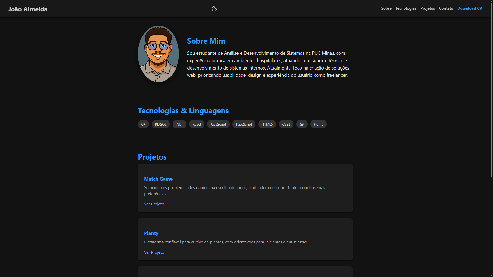
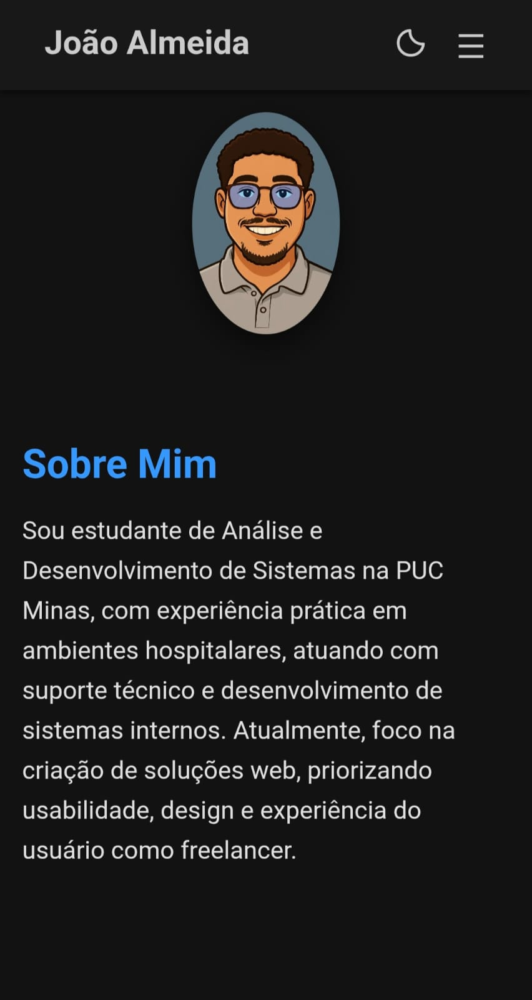
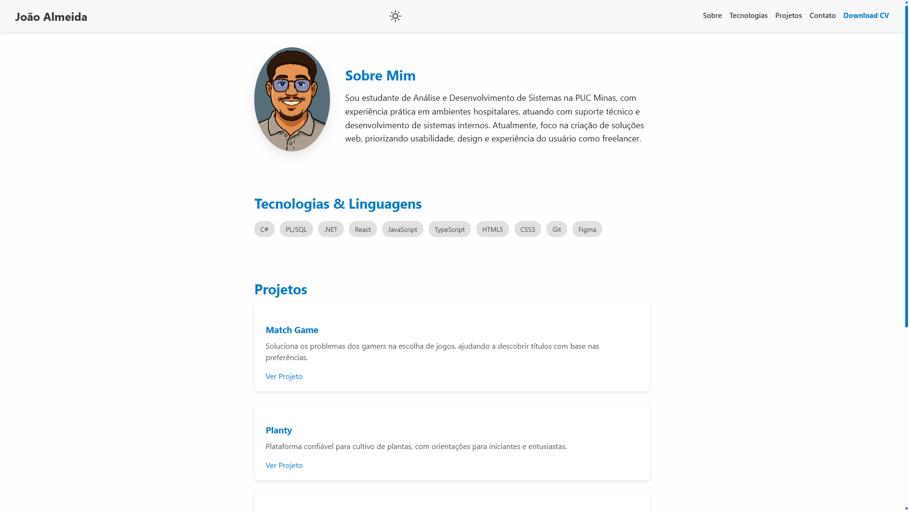

## 🖥️ Sobre o Portfólio

Este site foi desenvolvido para apresentar de forma objetiva e elegante meus principais trabalhos, habilidades técnicas e minha identidade como desenvolvedor.  
O design segue uma linha **minimalista e moderna**, com **modo claro e escuro**, priorizando **usabilidade** e **experiência do usuário**.

---

## 🛠️ Tecnologias Utilizadas

- **HTML5** e **CSS3** (animações, transições e modo dark/light)
- **JavaScript (ES6+)**
- **Git** & **GitHub** (para versionamento)
- **Figma** (para prototipação e imagens)

---

## 📷 Demonstração

  
  

   

  
  

